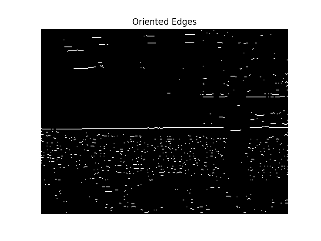

# Assignment 3: Edge & Line Detection

**Objective:** To understand the full pipeline from detecting low-level edge features to fitting high-level line models. This assignment focuses on debugging, experimentation, and analyzing the impact of parameter choices on algorithmic performance.

---

## Part 1: Debugging Oriented Edges [50 Points]

### 1.1 Introduction

In this part, you are tasked with fixing a bug in a function that's supposed to filter edges from an image based on a specified direction. The provided function `solution/oriented_edges.py` works correctly for some directions but fails for others.

For example, the figure below shows the expected correct output of the function for a `direction` of 0 degrees (function call: `oriented_edges(image, 1.4, 40, 0, 15)`).



Your goal is to **investigate** the code, **analyze** the incorrect output, **identify** the logical flaw, and **implement a fix**. This process mirrors a common real-world software engineering task.

### 1.2 The Task: Debug and Fix

The function `solution/oriented_edges.py` takes an image and several parameters and should return a binary image containing only the Canny edges that fall within a certain angular `tolerance` of a given `direction`.

**The Problem:** The function works correctly for a `direction` of 90 degrees (vertical edges) but produces an incorrect, almost empty image for a `direction` of 0 degrees (horizontal edges).

Your job is to:
1.  **Run the code:** Use the provided `main.py` script to observe the failure.
2.  **Investigate the logic:** Read through the `oriented_edges.py` file. The problem lies in how the `angle_diff` is calculated.
3.  **Debug:** Use `print()` statements or a debugger to inspect the values of `edge_direction`, `normalized_direction`, and `angle_diff` to understand why the logic is failing, especially for angles near the 0/180 degree boundary.
4.  **Fix the bug:** Replace the buggy lines of code with a correct implementation for calculating the shortest difference between two angles on a 0-180 degree circle.
5.  **Verify your fix:** Rerun your code to confirm that it now produces the correct output for all directions.

### 1.3 The Report for Part 1

In your `REPORT.md` file, under a heading for "Part 1", answer the following questions:

**Question 1.1: The Failure Case**
Run the *original, buggy* code with `direction=0`. Include a screenshot of the incorrect output image.

**Question 1.2: The Investigation**
Explain the bug. Why does the simple subtraction `np.abs(edge_direction - normalized_direction)` fail? Describe a specific example with actual angle values (e.g., "If the edge direction is `X` degrees and the target direction is `Y` degrees...") that demonstrates the failure. This is the most important part of the report.

**Question 1.3: The Fix**
Provide the line(s) of Python code that you replaced to fix the bug. You only need to show the corrected part.

**Question 1.4: The Success Case**
After fixing the bug, run your corrected function for all four primary directions (`direction` = 0, 45, 90, 135). Create a single composite image showing these four outputs and include it as a screenshot.

---

## Part 2: Implementing the Hough Transform [50 Points]

### 2.1 Introduction

Now that we can reliably detect edges, our next goal is to group these disconnected edge pixels into meaningful lines. In this part, you will work with an implementation of the Hough Transform, a powerful voting-based algorithm for line detection.

Your task is not just to get the code working, but to **experiment** with its parameters and **analyze** how they affect the detection results on different types of images.

### 2.2 The Task: Implement and Experiment

You will implement the core voting logic of the Hough Transform in the file `solution/detect_lines.py`. A significant portion of the code (setup, boilerplate) is already provided. You are **not allowed to use `cv2.HoughLines`**.

**Your Implementation Focus:**
Your main task is to complete the nested loop that iterates through the edge pixels and casts votes into the `accumulator` matrix. The surrounding code for setting up the accumulator and finding the peaks after voting is provided.

```python
def detect_lines(img, sigma, threshold, numLines):
    """
    Detects straight lines in an image using the Hough Transform.

    This function implements the line detection process from scratch, including
    the creation of the Hough accumulator space and the voting process.

    Args:
        img (np.ndarray): The input image (can be color or grayscale).
        sigma (float): The standard deviation for the Gaussian blur pre-processing.
        threshold (int): The lower threshold for the Canny edge detector.
        numLines (int): The number of top lines to return.

    Returns:
        list: A list of tuples, where each tuple is a (rho, theta) pair
              representing a detected line in polar coordinates.
    """
    ...
    ...
    return lines
```

### 2.3 The Report for Part 2

In your `REPORT.md` file, under a heading for "Part 2", answer the following questions. For this part, use the `data/railroad.jpg` and `data/perpendicular-lines.jpg` images.

**Question 2.1: The Accumulator Space**
The Hough accumulator is a key concept. Run your completed `detect_lines` function on `railroad.jpg`. The code will display the accumulator image. Include a screenshot of this accumulator in your report. **On the screenshot, circle the two brightest points** and draw arrows pointing to the two railroad tracks in the original image that these points correspond to.

**Question 2.2: Parameter Experimentation**
The quality of the detected lines depends heavily on the pre-processing and peak-finding parameters. For the `perpendicular-lines.jpg` image, experiment with the `sigma` (for Gaussian blur) and `threshold` (for Canny edge detection) parameters.
*   First, run with the default parameters (`sigma=2`, `threshold=30`). Include the output image showing the detected lines.
*   Now, find a *different* set of `sigma` and `threshold` values that produces a *worse* result (e.g., misses obvious lines, or detects many noisy lines). Include this worse output image.
*   In a short paragraph, explain **why** your new parameter choices led to a worse result, connecting it back to the concepts of blurring and edge detection.

**Question 2.3: Algorithmic Limitations**
The Hough Transform is excellent for straight lines but has limitations. Look at the `data/lanes.jpg` image, which contains slightly curved lines. 
- Would the standard Hough Transform be effective at detecting these entire lanes as single lines? Explain why or why not in 1-2 sentences. 
- How would you modify the algorithm to be more effective at detecting these curved lines? Provide a brief description of the modifications you would make.

## 5. Grading

Your assignment will be graded out of 100 points:

*   **Part 1 [50 Points]:**
    *   40 points from the autograder for the correctness of your **fixed** `oriented_edges` function.
    *   10 points for the analysis in your Part 1 report.
*   **Part 2 [50 Points]:**
    *   40 points from the autograder for the correctness of your `detect_lines` implementation. The tests will check if your function correctly identifies the main lines in test images.
    *   10 points for the experiments and analysis in your Part 2 report.