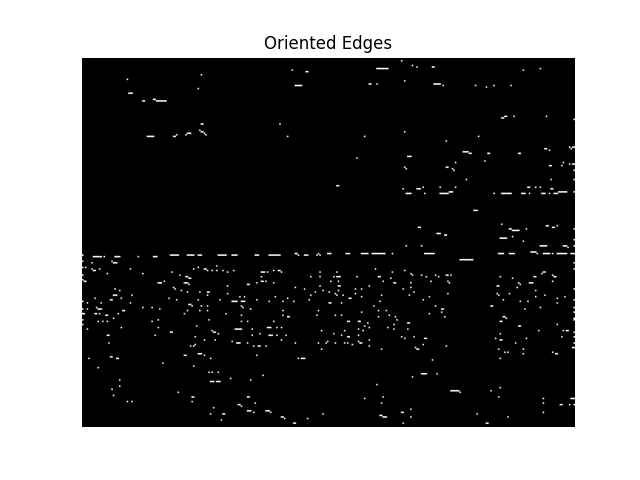

## Part 1

**Question 1.1:** The Failure Case Run the original, buggy code with direction=0. Include a screenshot of the incorrect output image.



**Question 1.2:** The Investigation Explain the bug. Why does the simple subtraction np.abs(edge_direction - normalized_direction) fail? Describe a specific example with actual angle values (e.g., "If the edge direction is X degrees and the target direction is Y degrees...") that demonstrates the failure. This is the most important part of the report.

**Answer:** Since the edge orientations are periodic modulo 180 degrees and a horizontal edge at 0 degrees is the same orientation as one at 180 degrees, the code ```    angle_diff = np.abs(edge_direction - normalized_direction)``` treats angles on a line and not a circle which overestimates the difference of 0 and 180 degrees. It wrongly labels ~180 degrees apart from 0 degrees and throws away.

**Question 1.3:** The Fix Provide the line(s) of Python code that you replaced to fix the bug. You only need to show the corrected part.

**Answer:** 

    # Check if the edge is within the tolerance
    # Minimal circular difference on a 180° circle → result in [0, 90]
    # Trick: shift into [-90, 90] by wrapping, then take abs
    def _angle_diff(a, b):
        return np.abs(((a - b + 90.0) % 180.0) - 90.0)

    assert _angle_diff(0, 179) == 1
    assert _angle_diff(0, 181) == 1
    assert _angle_diff(90, 270 % 180) == 0  # 90 vs 90
    assert _angle_diff(45, 135) == 90   

    angle_diff = _angle_diff(edge_direction, normalized_direction)

**Question 1.4:** The Success Case After fixing the bug, run your corrected function for all four primary directions (direction = 0, 45, 90, 135). Create a single composite image showing these four outputs and include it as a screenshot.


