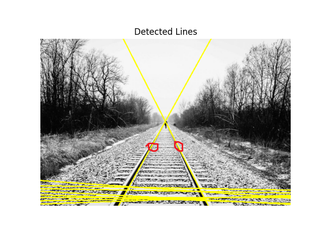
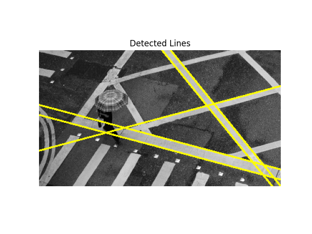
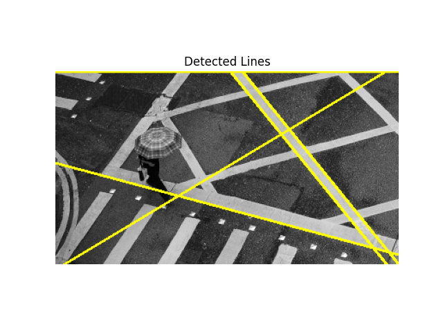

# Part 1 Report

**Question 1.1: The Failure Case** Run the original, buggy code with direction=0. Include a screenshot of the incorrect output image.

**Question 1.2: The Investigation** Explain the bug. Why does the simple subtraction np.abs(edge_direction - normalized_direction) fail? Describe a specific example with actual angle values (e.g., "If the edge direction is X degrees and the target direction is Y degrees...") that demonstrates the failure. This is the most important part of the report.

**Answer:** Since the edge orientations are periodic modulo 180 degrees and a horizontal edge at 0 degrees is the same orientation as one at 180 degrees, the code `    angle_diff = np.abs(edge_direction - normalized_direction)` treats angles on a line and not a circle which overestimates the difference of 0 and 180 degrees. It wrongly labels ~180 degrees apart from 0 degrees and throws away.

**Question 1.3: The Fix** Provide the line(s) of Python code that you replaced to fix the bug. You only need to show the corrected part.

**Answer:**

    # Check if the edge is within the tolerance
    # Minimal circular difference on a 180° circle → result in [0, 90]
    # Trick: shift into [-90, 90] by wrapping, then take abs
    def _angle_diff(a, b):
        return np.abs(((a - b + 90.0) % 180.0) - 90.0)

    assert _angle_diff(0, 179) == 1
    assert _angle_diff(0, 181) == 1
    assert _angle_diff(90, 270 % 180) == 0  # 90 vs 90
    assert _angle_diff(45, 135) == 90

    angle_diff = _angle_diff(edge_direction, normalized_direction)

**Question 1.4: The Success Case** After fixing the bug, run your corrected function for all four primary directions (direction = 0, 45, 90, 135). Create a single composite image showing these four outputs and include it as a screenshot.

.png>)

# Part 2 Report

**Question 2.1: The Accumulator Space** The Hough accumulator is a key concept. Run your completed detect_lines function on railroad.jpg. Tune the parameters (e.g. sigma, threshold) to get the best result. Try different values for numLines to see the impact on the result. Display the accumulator image for the best result. Include a screenshot of this accumulator in your report. On the screenshot, circle the two brightest points and draw arrows pointing to the two railroad tracks in the original image that these points correspond to.

**Question 2.2: Parameter Experimentation** The quality of the detected lines depends heavily on the pre-processing and peak-finding parameters. For the perpendicular-lines.jpg image, experiment with the sigma (for Gaussian blur) and threshold (for Canny edge detection) parameters.

- First, run with the default parameters (sigma=2, threshold=30). Include the output image showing the detected lines.

- Now, find a different set of sigma and threshold values that produces a worse result (e.g., misses obvious lines, or detects many noisy lines). Include this worse output image.

- In a short paragraph, explain why your new parameter choices led to a worse result, connecting it back to the concepts of blurring and edge detection.

**Answer:** The parameters I used to create the worse result image were setting sigma to 0.2 and threshold to 10. A low sigma keeps fine detail but has lots of noise edges since it smooths noise using the Gaussian blur before edge detection. A low threshold has many weak edges which creates a messy accumulator since it sets how strong an edge must be to count. Low values of sigma <= 1.0 and low values of threshold <= 70.

**Question 2.3: Algorithmic Limitations** The Hough Transform is excellent for straight lines but has limitations. Look at the data/lanes.jpg image, which contains slightly curved lines.

- Would the standard Hough Transform be effective at detecting these entire lanes as single lines? Explain why or why not in 1-2 sentences.

**Answer:** The standard Hough Transform would be effective in detecting the bottom, straighter part of the lanes since there direction is more defined and noticeable. The detection line function would not be able to differentiate the curve to the lanes/lines since it only models straight lines, so the curved lines would break up into individual lines possibly.

- How would you modify the algorithm to be more effective at detecting these curved lines? Provide a brief description of the modifications you would make.

**Answer:** To detect curves, the detect lines function could use a Polynomial or Generalized Hough transform since it allows for fitting parabolic or spline-shape curves instead of only straight lines. Another solution is using RANSAC (Random Sample Consensus) to estimate line segments and fit a smooth curve through them as commonly used in lane-detection systems.
